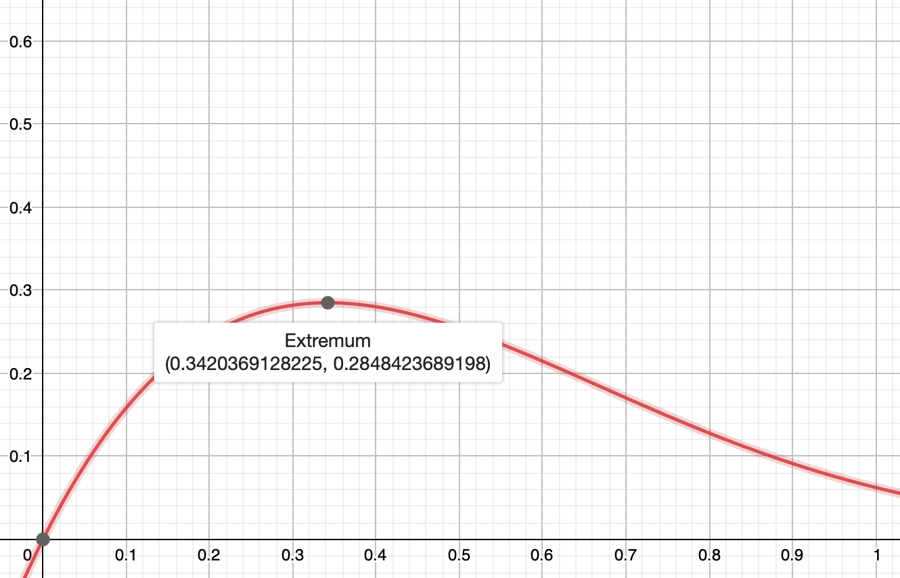

2020-05-01 Riddler Classic
==========================
Doing the extra credit version, since it's a generalization.

Since there is no way to distinguish between the prisoners, each prisoner
needs to follow the same algorithm: if the random number is less than _r_,
then flip, otherwise, don't flip.

Then, for each prisoner, the chance of flipping tails is _½r_, and the
chance of not flipping is _1 - r_.

The chance that nobody flipped tails is _(1 - ½r)N_,
and the chance that nobody flipped is _(1 - r)N_,
so the chance of being released is
_R = (1 - ½r)N - (1 - r)N_.

If _r = 0_, then _R = 0_.

If _r = 1_, then _R = 1/2N_.

Trying to find the maximum _R_ with respect to _r_,
_dR/dr = -½N(1 - ½r)N-1 + N(1 - r)N-1 = 0_, or
_½(1 - ½r)N-1 = (1 - r)N-1.

Also, _0 < r < 1_, and _d2R/dr2 < 0_.

Solving for _r_ gives

which can be used to calculate _R = (1 - ½r)N - (1 - r)N_.

For _N = 4_, the maximum is _R ≈ 0.285_, when _r ≈ 0.342_.

