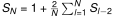

2020-07-03 Riddler Express
==========================
* ⅖ chance for the first swimmer to take a side lane:
  * ⅔ chance for the second swimmer to take a side or middle lane,
    resulting in 3 swimmers.
  * ⅓ chance for the second swimmmer to take the other lane, resulting
    in 2 swimmers.
* ⅕ chance for the first swimmer to take the middle lane, resulting in 3
  swimmers.
* ⅖ chance for the first swimmer to take one of the other lanes, resulting
  in 2 swimmers.

So the expected number of swimmers is
⅖×⅔×3 + ⅖×⅓×2 + ⅕×3 + ⅖×2 = 37/15 or 2 7/15.

Let _SN_ be the expected number of swimmers given _N_ lanes,
and _SN = 0_ when _N ≤ 0_.

The first swimmer has _1/N_ chance of taking lane _l_, resulting in expecting
_1 + Sl-2 + SN-l-1_ swimmers.

Summing gives .
