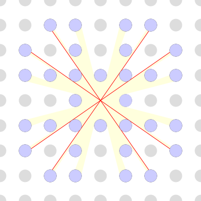
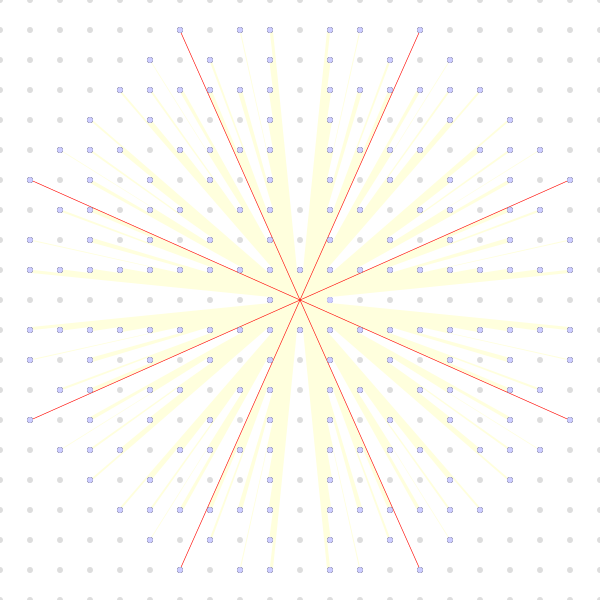

2023-08-11 Fiddler
==================
The four closest trees are at (1,0), (-1,0), (0,1), and (0,-1).  Then,
consider the number of trees I can see between the trees at (1,0) and (0,1).
By symmetry, I can see four times that number of trees plus the four closest
trees.

The closest of those trees is at (1,1).  Consider the number of trees I can
see between the trees at (1,0) and (1,1).  By symmetry, that is the same as
the number trees I can see between the trees at (1,1) and (0,1).

Let my line of sight be $y = ax$.  When $a = 0$, I'm looking straight at
the tree at (1,0).  When $a = 1$, I'm looking straight at the tree at
(1,1).

Given a tree at $(X,Y)$, the closest point on my line of sight to the center
of the tree is $(\frac{X+aY}{1+a^2},\frac{a(X+aY){1+a^2}})$, and the
closest distance is $\frac{|aX-Y|}{\sqrt{1+a^2}}$.  It's probably more
convenient to consider the square of the closest distance,
$\frac{(aX-Y)^2}{1+a^2}$.  The tree is in my line of sight when the
square of the closest distance is less than or equal to $R^2 = 1/16$,

$$ \frac{a^2X^2 - 2aXY + Y^2}{1+a^2} \le R^2 $$

which works out the tree being in my line of sight when $a$ is between
$\frac{XY-R\sqrt{X^2+Y^2-R^2}}{X^2-R^2}$ and
$\frac{XY+R\sqrt{X^2+Y^2-R^2}}{X^2-R^2}$.

The tree at (1,0) is in view for $-\sqrt{15} \le a \le \sqrt{15}$, or
$-0.2582 \lessapprox a \lessapprox 0.2582$.

The tree at (1,1) is in view for
$16/15 - \sqrt{31/225} \le a \le 16/15 + \sqrt{31/225}$, or
$0.6955 \lessapprox a \lessapprox 1.4379$.

The tree at (2,0) is in my line of sight for $-\sqrt{63} \le a \le \sqrt{63}$,
or $-0.1260 \lessapprox a \lessapprox 0.1260$, which means it's occluded by
the tree at (1,0).

The tree at (2,1) is in view for
$32/63 - \sqrt{79/3969} \le a \le 32/63 + \sqrt{79/3969}$, or
$0.3669 \lessapprox a \lessapprox 0.6490$.

The tree at (2,2) is in my line of sight for
$64/63 - \sqrt{127/3969} \le a \le 64/63 + \sqrt{127/3969}$, or
$0.8370 \lessapprox a \lessapprox 1.1948$, which means it's occluded by
the tree at (1,1).

The tree at (3,1) is in my line of sight for
$48/143 - \sqrt{159/20449} \le a \le 48/143 + \sqrt{159/20449}$, or
$0.2475 \le a \le 0.4238$, so it fills the view between the trees at
(1,0) and (2,1).

The tree at (3,2) is in my line of sight for
$96/143 - sqrt{207/20449} \le a \le 96/143 + \sqrt{207/20449}$, or
$0.5707 \lessapprox a \lessapprox 0.7719$, so it fills the view between
the trees at (2,1) and (1,1).

That makes 3 trees (at (3,1), (2,1), and (3,2)) visible between the trees
at (1,0) and (1,1).  By symmetry, that means there are 32 visible trees.

Extra credit
------------
Using [code](20230811.hs), when $R = 1/10$, the farthest 8 of the 192 visible
trees are at (9,4), (-9,4), (9,-4), (-9,-4), (4,9), (-4,9), (4,-9), and
(-4,-9).

The tree at (9,4) can be seen between the trees at (7,3) and (2,1), where
$700/1633 + \sqrt{1933/8000067} \le a \le 200/399 - \sqrt{499/159201}$, or
$0.44420 \lessapprox a \lessapprox 0.44527$.

Given a tree with radius $R$ at $(X,Y)$ and line of sight $y = ax$, the
end of the of the line of sight is at the smaller root of
$R^2 = (x-X)^2 + (ax - Y)^2$, which is

$$ x = \frac{X+aY - \sqrt{(X+aY)^2 - (1+a^2)(X^2+Y^2-R^2)}}{1+a^2} $$

making the length of the line of sight

$$ \frac{X+aY - \sqrt{(X+aY)^2 - (1+a^2)(X^2+Y^2-R^2)}}\sqrt{1+a^2} $$

When $X = 9$ and $Y = 4$ and $R = 1/10$, the minimum distance to the tree is
$\sqrt{97}-1/10 \approx 9.74886$ at $a = 4/9 \approx 0.4444$.
At $a \approx 0.4442$, looking just past the edge of the tree at (7,3),
the distance is approximately 9.74888.
At $a \approx 0.44527$, looking just past the edge of the tree at (2,1),
the distance is approximately 9.74908, which is the longest line of sight.

So, for the longest line of sight, $a = 200/399 - \sqrt{499/159201}$, and
the distance is

$$ \frac{9+4a - \sqrt{(9+4a)^2 - (1+a^2)\cdot 9699/100}}\sqrt{1+a^2} $$

or

$$ \frac{9+4\cdot(200/399 - \sqrt{499/159201}) - \sqrt{(9+4\cdot(200/399 - \sqrt{499/159201}))^2 - (1+(200/399 - \sqrt{499/159201})^2)\cdot 9699/100}}\sqrt{1+(200/399 - \sqrt{499/159201})^2} \approx 9.749084644686 $$

Making the rounds
-----------------
Since the ants are all moving at the same pace, all the ants should walk off
by 100 seconds.  If an ant starts from one end towards the other end, it
walks off the other end in 100 seconds.  If it turns around, it it must turn
around by the time it gets to the middle, and it can't turn around again.
In order for it to turn around a second time, it would have to be due to
another ant between it and the first end, and the time added by the second
backtrack would be canceled by the time not taken by not traveling the initial
distance between it and the second ant it collided with.
