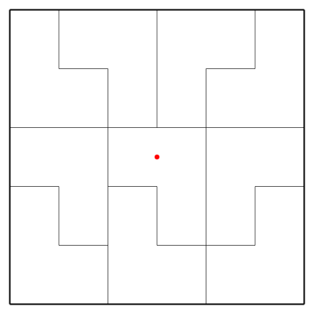

2023-09-29 Fiddler
==================
Let $F(n)$ be the number of flips on average to light all the lanes when $n$
lanes are lit.

$$ F(0) = 1 + F(1) $$

$$ F(1) = 1 + F(0)/4 + 3F(2)/4 $$

$$ F(2) = 1 + F(1)/2 + F(3)/2 $$

$$ F(3) = 1 + 3F(2)/4 + F(4)/4 $$

$$ F(4) = 0 $$

$$ F(2) = 1 + F(1)/2 + 1/2 + 3F(2)/8 $$

$$ F(2) = 12/5 + 4F(1)/5 $$

$$ F(1) = 1 + F(0)/4 + 9/5 + 3F(1)/5 $$

$$ F(1) = 7 + 5F(0)/8 $$

$$ F(0) = 8 + 5F(0)/8 $$

$$ F(0) = 64/3 \approx 21.3333 $$

$$ F(1) = 61/3 $$

$$ F(2) = 56/3 $$

$$ F(3) = 15 $$

It takes 21 1/3 flips on average to make all four lanes lit.

Extra credit
------------
Let $F(n)$ be the number flips on average to light all the lines
when $n$ lanes are lit for a given $N$, where $E(N) = F(0)$.

$$ F(n) = 1 + nF(n-1)/N + (N-n)F(n+1)/N $$

$$ F(0) = 1 + F(1) $$

$$ F(N) = 0 $$

Let

$$ F(n) = A(n) + B(n)F(n-1) $$

Then, when $N > 1$,

$$ A(N-1) = 1 $$

$$ B(N-1) = (N-1)/N $$

Substituting,

$$ F(n) = 1 + nF(n-1)/N + (N-n)(A(n+1) + B(n+1)F(n))/N $$

$$ (N - (N-n)B(n+1))F(n) = N + nF(n-1) + (N-n)A(n+1) $$

$$ A(n) = \frac{N + (N-n)A(n+1)}{N - (N-n)B(n+1)} $$

$$ B(n) = \frac{n}{N - (N-n)B(n+1)} $$

$$ F(0) = 1 + A(1) + B(1)F(0) $$

$$ F(0) = \frac{1 + A(1)}{1 - B(1)} $$

Also, $E(1) = 1$.

Using [code](20230929.hs) to tabulate $E(N+1)/E(N)$,

|$N$|$E(N+1)/E(N)$|
|---|-------------|
|1|$4/1 = 4.0$|
|2|$5/2 = 2.5$|
|3|$32/15 \approx 2.1333333333333333$|
|4|$2/1 = 2.0$|
|5|$39/20 = 1.95$|
|6|$151/78 \approx 1.935897435897436$|
|7|$2048/1057 \approx 1.9375591296121097$|
|8|$249/128 = 1.9453125$|
|9|$1460/747 \approx 1.9544846050870148$|
|10|$1433/730 \approx 1.963013698630137$|
|11|$31056/15763 \approx 1.9701833407346316$|
|12|$15341/7764 \approx 1.9759144770736734$|
|13|$394954/199433 \approx 1.980384389744927$|
|14|$783525/394954 \approx 1.9838386242448487$|
|15|$311296/156705 \approx 1.986509683800772$|
|16|$19345/9728 \approx 1.9885896381578947$|
|17|$654516/328865 \approx 1.9902269928390068$|
|18|$651745/327258 \approx 1.9915326745259092$|
|19|$24674528/12383155 \approx 1.992588157056905$|
|20|$15371097/7710790 \approx 1.9934529406195733$|

It looks like $E(N+1)/E(N)$ is a minimum of $151/78 \approx 1.935897435897436$
at $N = 6$, where $E(7) = 2416/15 \approx 161.0667$ and $E(6) = 416/5 = 83.2$.

Making the rounds
-----------------
I don't think I can figure out a way to do it in fewer than 10 tiles.

Consider L shaped tiles such that pairs can be combined into rectangles
two different ways.  Let one of the rectangles be $1 \times 2w$, so the
other rectangle is $2/3 \times 3w$.  Have $x$ of the first type of
rectangle fill a third of the square: $2wx = 1/3$.  Have $y$ of the
second type of rectangle parallel to the first rectangles, $3wy = 2/3$,
and $z$ of the second type of rectangle perpendicular to the
first rectangles, $3wz = 1/3$.

Then, $x = 1/6w$, $y = 2/9w$, $z = 1/9w$.  For $x$, $y$, and $z$ to all be
whole numbers, $w = 1/18n$, where $n$ is a whole number, so $x = 3n$,
$y = 4n$, $z = 2n$.  Take $n = 1$.  That means there are 9 rectangles or
18 tiles.

Unfortunately, the center is on an edge.  Fortunately, one of the
$1\times 1/9$ rectangles can be moved from the top to the bottom.

8 of the rectangles can be reflected, so this is 256 possible tilings.
Adding rotations and reflections of the square makes 2048 tilings.

### Another solution ###
Along the same lines, L shaped tiles that combine into $1/2 \times 2/5$
rectangles and $1/3 \times 3/5$ rectangles.

Using unicode box characters,

    ╔════╤═════════╤════╤═════════╗
    ║    │         │    │         ║
    ║    │         │    │         ║
    ║    │         │    │         ║
    ║    │         │    │         ║
    ║    │         │    │         ║
    ║    └────┐    │    └────┐    ║
    ║         │    │         │    ║
    ║         │    │         │    ║
    ║         │    │         │    ║
    ║         │    │         │    ║
    ║         │    │         │    ║
    ╟─────────┼────┴────┬────┴────╢
    ║         │         │         ║
    ║         │         │         ║
    ║         │    ×    │         ║
    ║         │         │         ║
    ║         │         │         ║
    ╟────┐    ├────┐    ├────┐    ║
    ║    │    │    │    │    │    ║
    ║    │    │    │    │    │    ║
    ║    │    │    │    │    │    ║
    ║    │    │    │    │    │    ║
    ║    │    │    │    │    │    ║
    ║    └────┤    └────┤    └────╢
    ║         │         │         ║
    ║         │         │         ║
    ║         │         │         ║
    ║         │         │         ║
    ║         │         │         ║
    ╚═════════╧═════════╧═════════╝

Each of the rectangles can be reflected, making 32 possible tilings.
Adding rotations of the square makes 128 possible tilings.

### Further thoughts ###
Given a square, those squares could be tiled $3 \times 3$, $5 \times 5$, etc.

Also, the 10-tile square (but not the 18-tile square, which has some tiles
rotated 90 degrees relative to other tiles) can be squashed into a rectangle
and tiled $3 \times 5$, $7 \times 9$, etc.
