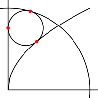

2023-10-06 Fiddler
==================
An upper bound is *1234500000* = 462120.  Then, to minimize, move digits to
the right of the 5.  The number to the right of the 5 must be a multiple
of the least common multiple of 1 through 5, or 60.  The number to the
right of the 5 cannot be more than 119, so it must be 60 = *22000*, so
the answer is *134522000* = 58980.

Extra credit
------------
Starting with *123456789000000000* = 401839064968320.  Then, move digits
to the right of the 9.  The number to the right of the 9 must be a multiple
of the least common multiple of 1 through 9, or 2520.

Using [code](20231006.hs), finds 65 multiples of 2520: *0*,
*10000000* = 7! = 5040, ... *860000000* = 352800, *870000000* = 357840,
where the 7! digit has 8 possibilities when the 8! digit is 0 or 8 and
the 7! digit has 7 possibilities when the 8! digit is 1 through 7.

So the answer is *1234569870000000* = 1502852999760.

### Further thoughts ###
Relaxing the requirement that each digit appears exactly once finds
144 numbers less than or equal to *123456789000000000*, the smallest of
which being *124569873300000* = 101773322280, since *3300000* = 2520.

Making the rounds
-----------------
Let the center of the smaller circle be at $(r,h)$.

Since the circles are tangent, their radii through the tangent point
must overlap, so $\sqrt{r^2+h^2} + r = 1$, giving $h^2 = 1 - 2r$.

To intersect the parabola, $(y^2-r)^2 + (y-h)^2 = r^2$, giving

$$ y^4 - 2ry^2 + r^2 + y^2 - 2hy + h^2 = r^2 $$

$$ y^4 + h^2y^2 - 2hy + h^2 = 0 $$

If the circle is too small, there will be no real roots.  If the circle is
too big, there will be two real roots.  For the circle to be tangent to
the parabola, it must be a degenerate root.

Numerically found that when $h \approx 0.7565$, there is a degenerate
root at $y \approx 0.5908$, making $r \approx 0.2139$.

