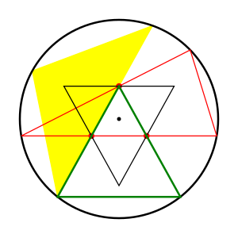

2024-01-05 Fiddler
==================
Given three points, if there is a triangle with three points on one edge,
the smallest largest triangle will have area of 1, which is when the three
points are on a diameter.  I hypothesize that the smallest largest triangle
is smaller than 1.

If the three points form a triangle not containing the center, a triangle
containing the center can be made with area of at least 1.

So the three points will make a largest triangle with either two points on
one edge and one on another, or with one point on each edge.

Let the middle point be $y$ from the center, and let the red chord passing
through the two points be $h$ from the center.

Let $r$ be the distance of the top two green sides from the center.

Then, the area of the yellow triangle is $(1-r)\sqrt{1-r^2}$, and
$x = \frac{r(y+h)}{\sqrt{y^2-r^2}}$ is half the distance between
the two points on the red chord.

The red chord cannot be closer to the center than $r$, otherwise the
isosceles triangle with the red chord as one side will be larger than
the yellow triangle, so $h \ge r$.

The two lower points cannot be further from the center than the middle point,
otherwise the red triangle will not be larger than the inner triangles
with a chord through the middle point and a lower point as an edge, so
$y^2 \ge x^2 + h^2$.

The area of the red triangle is
$(y_0+h)\sqrt{1-h^2}$, where $x_0^2 + y_0^2 = 1$ and
$y_0 - y = x_0 \frac{y+h}{\sqrt{1-h^2}}$.

The area of the black triangle is $4x(h+y)$ as long as $y+2h \le 1$
and $4x^2 + y^2 \le 1$.

The area of the green triangle is
is $x_1(y+y_1)$ where $x_1^2 + y_1^2 = 1$ and $y_1 + y = x_1(y+h)/x$,
so the area is $x_1^2(y+h)/x$.

$$ y_0^2(1 + (1-h^2)/(y+h)^2) - 2yy_0(1-h^2)/(y+h)^2 + y^2(1-h^2)/(y+h)^2 = 1 $$
$$ y_0^2((y+h)^2 + (1-h^2)) - 2y(1-h^2)y_0 + y^2(1-h^2) - (y+h)^2 = 0 $$

$$ x_1^2(1 + (y+h)^2/x^2) - 2y(y+h)x_1/x + y^2 = 1 $$
$$ x_1^2(x^2 + (y+h)^2) - 2xy(y+h)x_1 + x^2(y^2-1) = 0 $$

Evaluating [numerically](20240105.hs),
when $r = h = y/2$, which is when the points make an equilateral triangle,
the yellow and red triangles have equal areas of approximately 0.82864
when $r \approx 0.16048$.

The black and green triangles are smaller, and the only way I see to
make them larger while making the yellow and red triangles smaller is
to move the top point closer to the center than the other two points.

Making the rounds
-----------------
Tabulating the possible paths:
* L-LL B
* L-LR C
* L-RL C
* L-RR D
* RLLL B
* RLLR C
* RLRL C
* RLRR D
* RRLL C
* RRLR D
* RRRL D
* RRRR E

Each of the paths with 3 branches have 1/8 probability.

Each of the paths with 4 branches have 1/16 probability.

Adding up the probabilities,
* A 0/16
* B 3/16
* C 7/16
* D 5/16
* E 1/16
