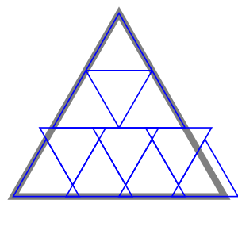

2024-01-19 Fiddler
==================
Consider if Alice carries Bob for $t_1$ minutes, then goes back and picks up
Carey at $t_2$ minutes, Alice will catch up to Bob at $t_3$ minutes.

At $t_2$ minutes, Carey will have walked $t_2/30$ and Alice will have walked
$t_2/10$, so $t_1 = 2t_2/3$.

At $t_3$ minutes, Bob will have gone
$t_1/10 + (t_3-t_1)/20 = t_1/20 + t_3/20 = t_2/30 + t_3/20$
and Alice will have traveled a net distance of
$t_2/30 + (t_3 - t_2)/10 = -2t_2/30 + t_3/10$,
so $t_2 = t_3/2$.

Alice's net distance is $2t_3/30$, which is $2/3$ of her total distance,
so they can all be home in 15 minutes.

Bob is carried 1/2 in 5 minutes, and walks 1/2 in 10 minutes.

Carey is carried 3/4 in 15/2 minutes, and walks 1/4 in 15/2 minutes.

Extra credit
------------
Start with Alice carrying Dee for $t_1$ minutes and Bob carrying Carey for
$t_2$ minutes.  Alice walks back to Bob for $t_2-t_1$ minutes.

At $t_2$ minutes, Bob will have walked $t_2/20$ and Alice will have walked
$t_2/10$, so $t_1 = 3t_2/4$.

Then, the Alice, Bob, and Carey problem is pretty much the same as in the
previous problem, except Bob will carry Dee when walking half the remaining
distance.  So Alice carries Bob from $t_2$ to $t_3$, and Bob carries Dee
from $t_3$ to $t_4$, where $t_3-t_2 = (t_4-t_3)/2$.

I can't see any way to make it faster by having Bob backtrack, since that
would only be useful if both Bob and Alice are ahead of both Carey and Dee
or if Alice is carrying one of them and Bob is ahead of the other.

Dee goes $t_1/10 + (t_3-t_1)/60$ before being carried the remaining
distance by Bob.  Bob goes $t_2/20 + (t_3-t_2)/10$ before carrying Dee
the remaining distance.  So $t_3 = 27t_2/20$ and $t_4 = 41t_2/20$.

Bob goes $t_2/20 + (t_3-t_2)/10 + (t_4-t_3)/20 = (1/20 + 7/200 + 14/400)t_2$,
so $t_2 = 25/3$ and $t_4 = 205/12$, or 17 minutes and 5 seconds.

Making the rounds
-----------------
For an upper bound, pack $n^2$ triangles against one vertex, then $n+1$ more
are needed for the opposite side.

I don't know if there's a way to do better than $n^2 + n + 1$.

Looking at the spoiler, $n^2 + 2$ possible.

I would guess that it could start with packing $n^2$ triangles against one
vertex, then squeezing the row of triangles next to the opposite side closer
together so that the triangles that are inverted with respect to the larger
triangle remain flush with the other triangles while the non-inverted
triangles can be shifted to be flush with the edge of the larger triangle.
This row can be packed against one of the vertices (with one vertex of the
closest inverted triangle extending infinitesmally outside of the larger
triangle), leaving a gap of infinitesmal width and length infinitesmally
more than one next to the other vertex.  That gap can be covered by two
triangles.

