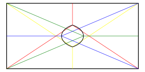

2024-03-01 Fiddler
==================
The total perimeter is 60 inches, so each piece needs 20 inches of the
original perimeter.  Given a point on the perimeter, the other two
points on the perimeter are determined.

The total area is 200 square inches, so the area of each piece must be
200/3 square inches.  Given two points on the perimeter, the possible
interior cut points form a curve, so if the three curves intersect at a
single point, that determines the interior cut point.

Consider having two of the points on corners joined by a 20 inch side,
the third point would be in the middle of the other 20 inch side, and the
interior cut point would be 10/3 inches from the third point along the
bisecting axis.

Extra credit
------------
Let the first point be $s$ inches from a corner along a 20 inch side.
The range $0 \le s < 10$ is sufficient to cover all possible cases.

The second point will be $s$ inches from the other corner of that
20 inch side, but along the 10 inch side.

The third point will be $10+s$ inches from the opposite corner along
the other 20 inch side.

Let the interior cut point be at $(x,y)$ and the edge points be at
$(s,0)$, $(20,s)$, $(10-s,10)$.

The areas are
$$
\begin{aligned}
  200/3 &= (10-s)(10-y) + (x+s-10)(10-y)/2 + sy + (x-s)y/2 \\
        &= (20-x)(10-y) + (x+s-10)(10-y)/2 + (20-x)(y-s)/2 &= 200/3 \\
        &= (x-s)y/2 + s(20-x) + (20-x)(y-s)/2
\end{aligned}
$$

Simplifying,
$$
\begin{aligned}
  200/3 &= 50 - 5s + 5x + (s-5)y \\
        &= 150 - 5s + (s/2-5)x - (s/2+5)y \\
        &= 10s - sx/2 + (10-s/2)y
\end{aligned}
$$

The three curves are three lines
$$
\begin{aligned}
  y &= \frac{50 + 15s - 15x}{3(s-5)} \\
  y &= \frac{500 - 30s + 3(s-10)x}{3(s+10)} \\
  y &= \frac{400 - 60s + 3sx}{3(20-s)}
\end{aligned}
$$
At $s = 5$, due to symmetry, it must be that $x = 25/3$, $y = 5$ when $s = 5$.
But the first piece can have $x = 25/3$ with any $0 \le y \le 10$ with
a third of the area, so I won't worry about dividing by zero.

$$ x = \frac{2000 - 300s + 30s^2}{200 - 20s + 2s^2} $$

This defines the following shape:

The red and yellow correspond to cuts when $s = 0$.

The blue and green correspond to cuts when $s = 5$.

Due to symmetry, $x(s) = x(10-s)$, $y(s) = 10 - y(10-s)$.

Then, the area in the shape is $A = 4\int_0^5 (y - 5) \frac{dx}{ds} ds$.

$$ \frac{dx}{ds} = \frac{-300s + 60s}{200 - 20s + 2s^2} - \frac{(2000 - 300s + 30s^2)(-20 + 4s)}{(200 - 20s + 2s^2)^2} $$

Using Wolfram Alpha,
$A = -\frac{50}{81}(-645 + 284\pi\sqrt{3} - 6480\ln 2 + 3240\ln 3) \approx 19.588$

Eyeballing the picture, that seems too big by a factor of about 2, it seems
like it should be closer to 8.5, so I must have made some mistake.

Making the rounds
-----------------
For the second puzzle, let the smaller squares have side length 1.  The larger
square has side length $2+x$.  When $x = 0$, the angle is 45°.  When $x = 1$,
the angle is $\tan^{-1}2 - \tan^{-1}(1/3}$, or 45°.  I'll assume the angle
remains 45° for all $x$, but I won't try to prove it.
