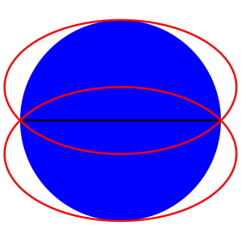
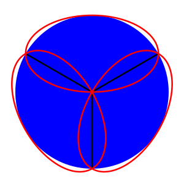
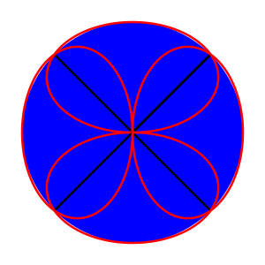
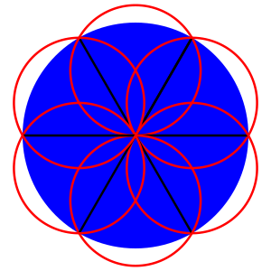
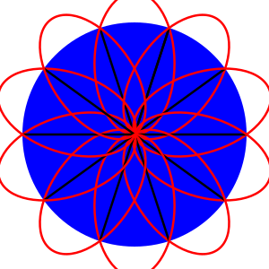

2024-04-12 Fiddler
==================
One ellipse must cover at least half of the circle.  The circle does not
necessarily need to be divided along a diameter, but I don't see how
anything else would allow a smaller ellipse.  A disjoint half of the circle
would certainly waste lots of ellipse area.  An ellipse with half the area
of the circle cut out of the circle would minimize the area needed to
cover one of the halves, but the other half would need the original circle
to be covered.

Consider a semicircle, $x^2 + y^2 \le 1$, where $y \ge 0$, covered by an
ellipse $x^2/a^2 + (y-h)^2/b^2 \le 1$, which has area $\pi ab$.

Considering $y = 0$, $1/a^2 + h^2/b^2 = 1$ to barely cover the cusps.

Considering $x = 0$, $(1-h)^2/b^2 = 1$ to barely cover the apex.

That makes $b = 1-h$, $a = (1-h)/\sqrt{1-2h}$, so the area of the ellipse
is $\pi(1-h)^2/\sqrt{1-2h}$.

Minimizing gives $h = 1/3$,
so the area is $\frac{4\pi\sqrt3}{9} \approx 0.77\pi$.

Extra credit
------------
One ellipse must cover at least $1/N$ of the circle.  I'll rule out asymmetric
and disjoint divisions of the circle into $N$ pieces to be covered.

Consider a sector of the circle where $x^2 + y^2 \le 1$, where $y > 0$ and
$x/y \le \tan{pi/N}$, covered by an ellipse $x^2/a^2 + (y-h)^2/b^2 \le 1$,
which has area $\pi ab$.

To cover the circle center, $h \le b$.

To barely cover the cusps, $sin^2(\pi/N)/a^2 + (cos(\pi/N)-h)^2/b^2 = 1$.

To cover the apex, $(1-h)^2/b^2 \le 1$.

Let $S = \sin(\pi/N)$ and $C = \cos(\pi/N)$.

If the ellipse intersects the circle center and the apex, $h = 1/2$, $b = 1/2$.
If the ellipse also intersects the cusps, $a = S/(2\sqrt{C(1-C)})$,
so the area is $A = \pi S/(4\sqrt{C(1-C)})$.

When $N = 3$, $S = \sqrt3/2$, $C = 1/2$, so $a = \sqrt3/2$, and the area
is $\pi\sqrt3/4$.

When $N = 4$, $S = C = \sqrt2/2$, so $a = 1/(2\sqrt{\sqrt2-1})$,
and the area is $\pi/(4\sqrt{\sqrt2-1})$.

For larger $N$, the minimal ellipse will no longer
intersect the apex, since it'll be better to make ellipse narrower and
$h$ will increase, approaching $2/3$ for large $N$.

For one end of the ellipse to be at the circle center, $b = h$,
and $a = hS/\sqrt{C(2h-C)}$, so the area is
$A = \pi h^2S/\sqrt{C(2h-C)}$.  Minimizing with respect to $h$ gives
$h = 2C/3$.  Also, $h \ge 1/2$ to contain the apex, which is the case
for $N \ge 5$.  So the area $A = \pi SC\sqrt{16/27}$, which is less than
$A = \pi S/(4\sqrt{C(1-C)})$.

When $N=6$, the ellipse is a circle with radius $1/\sqrt3$.

In summary, when $N=2$, the area is $\pi\sqrt{16/27}$.

When $N=3$ and $N=4$, the area is
$\pi\sin(\pi/N)/\sqrt{\cos(\pi/N)(1-\cos(\pi/N))}$.

When $N\ge5$, the area is
$\pi\sin(\pi/N)\cos(\pi/N)\sqrt{16/27}$.
