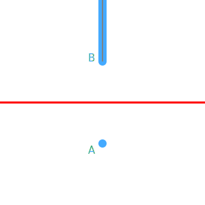

2024-05-24 Fiddler
==================
There are 10! orderings.  To have a sum of 21, I must draw at least 3 cards,
and no more than 6.

If I draw 6 cards, the first six cards must be 1,2,3,4,5,6, so there are
6!⋅4! orderings that draws a sum of 21.

There are 9 combinations of 5 cards that sum to 21, so there are 9⋅5!⋅5!
ways for that.  They are (1,2,3,5,10),(1,2,3,6,9),(1,2,3,7,8),(1,2,4,5,9),
(1,2,4,6,8),(1,2,5,6,7),(1,3,4,5,8),(1,3,4,6,7),(2,3,4,5,7).

There are 16 combinations of 4 cards that sum to 21, so there are 16⋅4!⋅6!
ways for that.  They are (1,2,8,10),(1,3,7,10),(1,3,8,9),(1,4,6,10),(1,4,7,9),
(1,5,6,9),(1,5,7,8),(2,3,6,10),(2,3,7,9),(2,4,5,10),(2,4,6,9),(2,4,7,8),
(2,5,6,8),(3,4,5,9),(3,4,6,8),(3,5,6,7).

There are 7 combinations of 3 cards that sum to 21, so there are 7⋅3!⋅7!
ways for that.  They are (2,9,10),(3,8,10),(4,7,10),(4,8,9),(5,6,10),(5,7,9),
(6,7,8).

That makes the probability (6!⋅4!+9⋅5!⋅5!+16⋅4!⋅6!+7⋅3!⋅7!)/10! = 7/40.

[Simulations](20240524.go) agree with approximately 0.175.

Extra credit
------------
There are 285 possible states of the deck, 33 of which are winning states.

In general, that would mean inverting a 285×285 matrix.  For example, if
instead of starting over, I shuffle back a random drawn card back into the
deck and I wanted the average number times I shuffled.  In another example,
if I shuffle back the most recently or least recently drawn card into the
deck, then it would mean inverting a 7109×7109 matrix, though that matrix
would be more sparse.

However, since quitting means starting over from the initial state, let

$$ N_S = a_S N_\emptyset + b_S $$

where $S$ is the set of drawn cards, which is the state, and $\emptyset$ is the
initial state.

$$ N_\emptyset = (a_1 + a_2 + a_3 + a_4 + a_5 + a_6 + a_7 + a_8 + a_9 + a_{10}) N_\emptyset/10 + (b_1 + b_2 + b_3 + b_4 + b_5 + b_6 + b_7 + b_8 + b_9 + b_{10})/10 $$

so

$$ a_1 = (a_{1,2} + a_{1,3} + a_{1,4} + a_{1,5} + a_{1,6} + a_{1,7} + a_{1,8} + a_{1,9} + a_{1,10})/9 $$

and so on.  For states that result in winning,

$$
\begin{aligned}
  a_{4,8,9} &= 0 \\
  b_{4,8,9} &= 1
  \end{aligned}
$$

For states that result in starting over,

$$
\begin{aligned}
  a_{8,9} &= 1 \\
  b_{8,9} &= 1
  \end{aligned}
$$

so it turns out that $b_S = 1$.  Finally,

$$ N_\emptyset = \frac{b_\emptyset}{1-a_\emptyset} $$.

Using [code](20240524.hs), $a_\emptyset = 617/630$, $b_\emptyset = 1$, giving
$N_\emptyset = 630/13 \approx 48.46$.

[Simulations](20240524.go) agree with approximately 48.

### Alternate approach
In order to win a round, the last card drawn must be the largest card left
in the deck.

If $p$ is the probability of winning a round, then the expected number of
rounds before winning is $1/p$.

There is no way to win drawing 6 cards.

When drawing 5 cards, there is just (1,2,3,5,10), so there are 4!⋅5!
winning combinations.

When drawing 4 cards, there are 5 combinations, (1,2,8,10),(1,3,7,10),
(1,4,6,10),(2,3,6,10),(2,4,5,10), so there are 5⋅3!⋅6! winning combinations.

When drawing 3 cards, there are 4 combinations, (2,9,10),(3,8,10),(4,7,10),
(5,6,10), but (2,9,10) can have either 9 or 10 as the last card
drawn, so there are 5⋅2!⋅7! winning combinations.

That makes the probability of winning a round
(4!⋅5!+5⋅3!⋅6!+5⋅2!⋅7!)/10! = 13/630, so the expected number of
rounds = 630/13.

Making the rounds
-----------------
I assume all points must be in a plane, since, in 3 dimensions, the set of
points equidistant from two points is a plane.

Object B can be more than a point.  Object B can be a line perpendicular to
the equidistant line, excluding the parts closer to the equidistant line than
point A is, and excluding the parts closer to point A than to the equidistant
line, or any subset that includes the point closest to point A.

