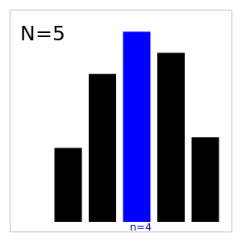
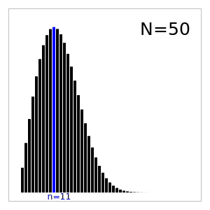
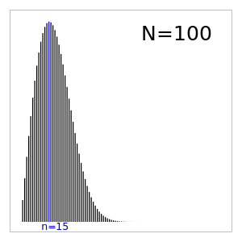

2024-06-28 Fiddler
==================
After the second sock, the chance is 1/9.

After the third sock, the chance that the second sock didn't match the
first is 8/9, so the chance is 8/9⋅2/8=2/9.

After the fourth sock, the chance that there were no previous pairs is
1-1/9-2/9=2/3, so the chance is 2/3⋅3/7=2/7.

After the fifth sock, the chance that there were no previous pairs is
1-1/9-2/9-2/7=8/21, so the chance is 8/21⋅4/6=16/63.

After the sixth sock, the chance that there were no previous pairs is
1-1/9-2/9-2/7-16/63=8/63, so the chance is 8/63⋅3/3=8/63.

Since 2/7=18/63 > 16/63 gives the greatest chance, I should draw four socks.

Extra credit
------------
There are a total of $(2N)!/2^N$ ways to draw all the socks.

There are $2N\cdot(2N-2)\cdot(2N-4)\cdot(2N-6)\cdot \ldots \cdot(2N-2(n-1))
  = N!2^n/(N-n)!$ ways to draw $n$ socks without drawing any pairs.

The number of ways to draw the remaining socks, which contain $N$ pairs,
is $(2N-n)!/2^N$.

So the probability of drawing no pairs in the first $n$ socks is

$$ \frac{N!2^n(2N-n)!}{(N-n)!(2N)!} $$

Then, the probability the that $n+1$-th sock makes the first pair is
$n/(2N-n)$.

So the probability that the $n+1$-th sock is the first pair is

$$ \frac{N!2^n(2N-n)!n}{(N-n)!(2N)!(2N-n)}
  = \frac{2^nnN!(2N-n-1)!}{(N-n)!(2N)!}
$$

Turn it into a continuous function of $n$ by replacing the factorials
with gamma functions.

$$ \frac{2^nnN!\Gamma(2N-n)!}{\Gamma(N-n)(2N)!} $$

Using Wolfram Alpha to take the derivative with respect to $n$,

$$ \frac{2^nN!\Gamma(2N-n)(n\psi^{(0)}(N-n)-n\psi^{(0)}(2N-n) + n\ln2 + 1)}
   {(2N)!\Gamma(N-n)} $$

Any extremum would have

$$ n(\psi^{(0)}(N-n) - \psi^{(0)}(2N-n) + \ln2) + 1 = 0 $$

Then, using $\psi^{(0)}(z) \approx \ln z - 1/2z$ for large $z$,

$$ n(\ln(N-n) - 1/(2(N-n)) - \ln(2N-n) + 1/(2(2N-n)) + \ln2) \approx -1 $$

Assuming $N \gg n \gg 1$ and approximating the logs as
$\ln(N-n) \approx \ln N - n/N$,

$$ n(\ln N - n/N - \ln(2N) + n/2N + \ln2) \approx -1 $$

giving $n \approx \sqrt{2N}$.

[Code](20240628.hs) confirms the approximation.
[Simulations](20240628.go) agree with the probability calculations.

Bar graph of the probability of drawing the first pair versus the draw for
$N=5$

Bar graph of the probability of drawing the first pair versus the draw for
$N=50$

Bar graph of the probability of drawing the first pair versus the draw for
$N=100$

Making the rounds
-----------------
Any triangle can be cut into a $n^2$ congruent triangles by
dividing each edge into $n$ equal segments and cutting from the divisions.

Any isosceles triangle can be cut into 2 congruent right triangles.
Thus, an isosceles right triangle can be cut into $2^n$ congruent isosceles
right triangles.

An equilateral triangle can be cut into 3 congruent isosceles triangles,
so it can also be cut into 6 congruent right triangles.

With these, $n^2$, $2n^2$, $3n^2$, and $6n^2$ where $n$ is a whole number
make up at least a subset of $N$.

So $N$ contains numbers that have any number of factors of 2, any number of
factors of 3, even numbers of any other prime factor.

The next prime is 5, so the next step would be considering if it's possible
to cut a triangle into 5, 10, 15, and 30 triangles.

When considering cuts, they could start from none of the original vertices,
which means the triangles are similar to the original.  There could be
cuts that start at a vertex, as with cutting the equilateral triangle into
3.  There could be cuts that starts at an edge.  There must be a cut starting
either at an edge or a vertex.

There can be no more than 3 distinct lengths that the edges can be divided
into, including undivided edges.

The smallest angle of the smaller triangles cannot be greater than the
smallest angle of the original triangle, so only equilateral triangles can
be cut into equilateral triangles.  (Conversely, equilateral triangles cannot
be tiled into non-equilateral triangles.)

Any point on a non-vertex edge of a triangle, either original or smaller,
that is a vertex of a smaller triangle must either be the vertices of three
smaller triangles, or be multiple vertices with the same angle
and have no more than two unique angles among the vertices.
