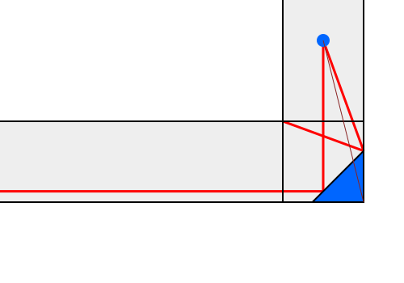

2024-07-05 Fiddler
==================
I can see the rightmost 3/2 meters of the bottom wall in the absence of the
mirror, but points along the bottom wall further to the left require the
mirror.  The other key point is the upper right corner of the corridor.

Let $d = L/\sqrt2$ be the distance between an edge of the mirror and the
lower right corner of the turn.

Let the lower right corner be the origin, so that my position is $x = 1/2$
and $y = 2$.

When looking at the upper right edge of the mirror, my line of sight is
$y = 2(2-d)x + d$.  The reflected line of sight is $y = x/(4-2d) + d$.
When $x = 1$, the reflected line of sight is at $y = 1/(4-2d) + d$.
For $y = 1$, the upper right corner of the corridor, $2d^2-6d+3=0$.
Solutions are $3/2\pm\sqrt{3/4}$.  Picking the root that is less than
1, that gives $d = (3-\sqrt3)/2$, so $L = (3-\sqrt3)/\sqrt2$ is the
minimum size of the mirror to see the upper right corner of the corridor.
Larger mirrors will allow me to see the reflection of the lower left wall
that I can already see without the mirror.

An infinitesmally small mirror will allow me to see the upper wall at
$x = 4$, or 3 from the corner.  A mirror where $d < 1/2$, or $L < 1/\sqrt2$,
will only allow me to see a finite ways along the corridor, and none of the
points along the lower wall.  When $d > 1/2$, the left part of the mirror
will allow me to see the lower wall from $d$ to infinity.

So there are 2 lower limits.  To see infinitely to the left,
$L \ge 1/\sqrt2 \approx 0.707$.
To see the upper left corner $L \ge (3-\sqrt3)/\sqrt2 \approx 0.897$.

That means, so see the entire corridor, the minumum $L = (3-\sqrt3)/\sqrt2$.

Extra credit
------------
Let $a$ be the distance from the lower right corner to the lower left edge
of the mirror and $b$ be the distance from the lower right corner to the
upper right edge of the mirror so that $a^2 + b^2 = L^2$.  Let
$\tan\theta = b/a$ be the angle of the mirror.

For a given $b$, there is a minimum $a = \alpha(b)$ for which the upper
right edge of the mirror can see the reflection of the rightmost point on
the top wall.  Larger $a$ will allow seeing the reflection of the left wall
to my right.  This gives $L = B(b)$.

For a given $a$, there is a minimum $b = \beta(a)$ for which lower left
edge of the mirror is the reflection of infinity to the left.  Larger $b$
will allow seeing the reflection of the bottom wall, and I can also see
rightmost 3/2 meters of the bottom  wall in the absence of a mirror.  But,
it's not necessary to see the bottom wall to see all of the corridor as
long as I can see to infinity along the bottom wall.  This gives $L = A(a)$.

### Left edge

Given $a$, let $\tan\phi = (1/2-a)/2$ be the angle of my line of sight to
the lower left edge of the mirror.  Then, the angle of reflection is
$2\theta-\phi$, and to see to infinity, $\tan(2\theta-\phi) = \infty$.  Using
$\tan2\theta = 2\tan\theta/(1-\tan^2\theta) = 2ab/(a^2-b^2)$,

$$
\begin{aligned}
  \tan(2\theta-\phi)
    &= \frac{\tan2\theta-\tan\phi}{1 + \tan2\theta\tan\phi} \\
  \tan2\theta\tan\phi &= \frac{2ab(1-2a)}{4(a^2-b^2)} = -1 \\
    &= \frac{2ab}{a^2-b^2} - \frac{1-2a}{4} \\
    &= 0 \\
\end{aligned}
$$

Solving, for $b$ gives

$$
  b \ge \beta(a) = \frac{-2a^2 + a \pm \sqrt{a^2 (4 a^2 - 4 a + 17)}}{4}
$$

The root of interest, which has $0 < \beta < 1$ when $0 < a < 1$, has
the plus sign.  This gives

$$
\begin{aligned}
  A(a) &= \sqrt{a^2 + \beta(a)^2} \\
       &= \sqrt{a^2 + \frac{(-2a^2 + a + \sqrt{a^2 (4 a^2 - 4 a + 17)})^2}{16}} \\
\end{aligned}
$$

### Right edge

Given $b$, let $\tan\phi = 1/(2(2-b))$ be the angle of my line of sight to
the upper right edge of the mirror.  Then, the angle of reflection is
$\psi = 2\theta-\phi$, and to see the corner, $\tan\psi = 1/(1-b)$,

$$
\begin{aligned}
  \tan\psi &= \tan(2\theta-\phi)
    &= \frac{-\tan\phi + \tan2\theta}{1 + \tan\phi\tan2\theta} \\
    &= \frac{-a^2 - 4 a b^2 + 8 a b + b^2}
            {-2 a^2 b + 4 a^2 + 2 a b + 2 b^3 - 4 b^2} \\
    &= \frac{1}{1-b} \\
\end{aligned}
$$

which gives
$$
  a \ge \alpha(b) = \frac{-2 b^3 + 6 b^2 \pm sqrt{4 b^6 - 24 b^5 + 57 b^4 - 66 b^3 + 34 b^2} - 3 b}{3 b - 5}
$$

The root of interest, which has $0 < \alpha < 1$ when $0 < b < 1$ has the minus
sign.  This gives

$$
  B(b) = \sqrt{\alpha(b)^2 + b^2}
       = b \sqrt{\frac{(2 b^2 + \sqrt{4 b^4 - 24 b^3 + 57 b^2 - 66 b + 34} - 6 b + 3)^2}{(5 - 3 b)^2} + 1}
$$

### Both edges

To satisfy both edges,

$$ A(a) = B(\beta(a)) $$

or

$$ A(\alpha(b)) = B(a) $$

It may be possible that the minimum $L$ either can see the bottom wall at
the left end of the mirror or the wall to my right at the right end of the
mirror, by increasing $a$ and decreasing $b$, or by decreasing $a$ and
increasing $b$, but that is getting too complicated, and numerical evaluation
suggests that this is not the case.

[Numerical evaluation](20240705.hs) gives $a \approx 0.61579$,
$\beta(a) \approx 0.58117$, $A(a) \approx 0.84673$,
$\alpha(\beta(a)) \approx 0.61579$.

Also, $b \approx 0.58116$, $\alpha(b) \approx 0.61578$, $B(a) \approx 0.84672$,
$\beta(\alpha(b)) \approx 0.5116$.

So it seems like the minimum $L \approx 0.8467$.

### Analytic calculation

The smallest mirror will have

$$
\begin{aligned}
    a &= \alpha(\beta(a)) \\
      &= \frac{-2 \beta(a)^3 + 6 \beta(a)^2 - sqrt{4 \beta(a)^6 - 24 \beta(a)^5 + 57 \beta(a)^4 - 66 \beta(a)^3 + 34 \beta(a)^2} - 3 \beta(a)}{3 \beta(a) - 5} \\
    \beta(a) &= \frac{-2a^2 + a + \sqrt{a^2(4a^2 - 4a + 17}}{4} \\
\end{aligned}
$$

Using Wolfram Alpha,

$$
\begin{aligned}
  a &= \frac{1}{12}\left(4 - \frac{161}{(838 + 15\sqrt{21669})^{1/3}}
      + (838 + 15\sqrt{21669})^{1/3} \right) \\
    & \approx 0.61578 \\
  b &= \frac{1}{4} \left(
      \frac{1}{12} \left(4 - 161(838 + 15 \sqrt{21669})^{-1/3} + (838 + 15 \sqrt{21669})^{1/3}\right) -
      \frac{1}{72} \left(4 - 161(838 + 15 \sqrt{21669})^{-1/3} + (838 + 15 \sqrt{21669})^{1/3}\right)^2 +
      \frac{1}{12} \left(4 - 161(838 + 15 \sqrt{21669})^{-1/3} + (838 + 15 \sqrt{21669})^{1/3}\right)
          \sqrt{17 +
              \frac{1}{3} \left(-4 + 161(838 + 15 \sqrt{21669})^{-1/3} - (838 + 15 \sqrt{21669})^{1/3}\right) +
              \frac{1}{36} \left(4 - 161(838 + 15 \sqrt{21669})^{-1/3} + (838 + 15 \sqrt{21669})^{1/3}\right)^2}\right) \\
    & \approx 0.58116 \\
  L &= \frac{1}{16\sqrt{\frac{3}{-1207 + (1191402449 - 7523448 \sqrt{21669})^{1/3} + (1191402449 + 7523448 \sqrt{21669})^{1/3}}}} \\
    & \approx 0.84672 \\
\end{aligned}
$$

Making the rounds
-----------------
Let the side of the small square be $1$ and the side of the large square be
$1+x$.  Let $y$ be the distance from the upper left corner of the large
square to the top corner of the small square.

The left triangle gives $(1+x)^2 = 1 + (1-y)^2$.  Since the top triangle is
similar to the left triangle, $y/x = 1/(1+x)$.  Substituting and solving
with Wolfram Alpha gives $x = \sqrt{(1+\sqrt5)/2} - 1$.  The ratio
of the areas is $(1+x)^2 = (1+\sqrt5)/2$, the golden ratio.
