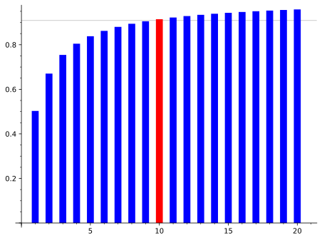

2024-07-19 Fiddler
==================
Let the speed of a solo rider at power 1 be 1.

A rider in a group of $n$ would have power $p$ for $1/n$ of the time
and power $p/2$ for $(n-1)/n$ of the time, for an average power of
$p(n+1)/2n = 1$.  That means the speed of the group is $2n/(n+1)$.

For the group of four, the speed would be 8/5 that of the solo rider,
so they would cover 10km in time the solo rider would cover 6.25km, so
the chase group could be back 3.75km.

Extra credit
------------
Let $N = 176$, and $n$ be the size of the breakaway.

The speed of the peloton is $2(N-n)/(N-n+1)$, and the speed of the
breakaway is $2n/(n+1)$, so, for the breakaway to succeed, the ratio
of the speeds must be greater than 10/11,

$$ r = \frac{n(N-n+1)}{(N-n)(n+1)} > 10/11 $$

For $N = 176$, $n = 9$, $r = 756/835 < 10/11$, the breakaway is caught.

For $N = 176$, $n = 10$, $r = 835/913 > 10/11$, the breakaway succeeds.

Making the rounds
-----------------
It looks like the terms of the progression approach $\pi/10^{n+2}$,
where $n$ is the number of 5s.

For small $x$, $\sin x \approx x$, so the progression approaches

$$ \frac{\pi}{180\sum_{i=0}^{n-1} 5\cdot 10^i} $$

And since $180\cdot 5 = 900$, the denominator is $10^{n+2}-100$,
which can be approximated by $10^{n+2}$ when $n$ is large.
